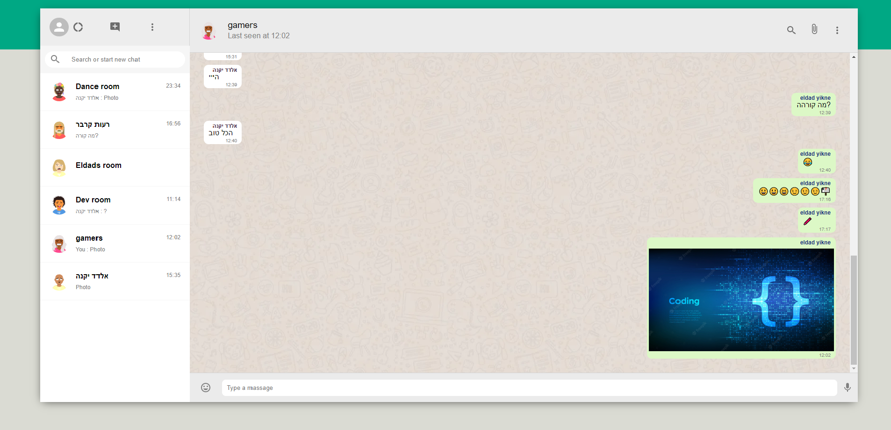
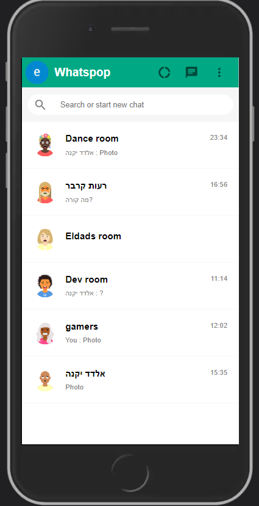
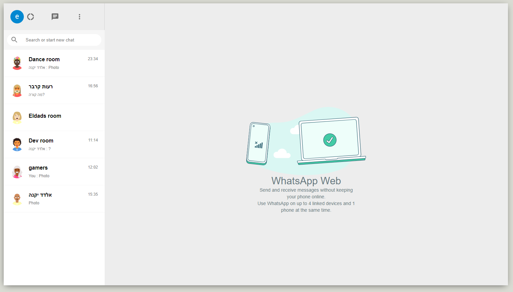
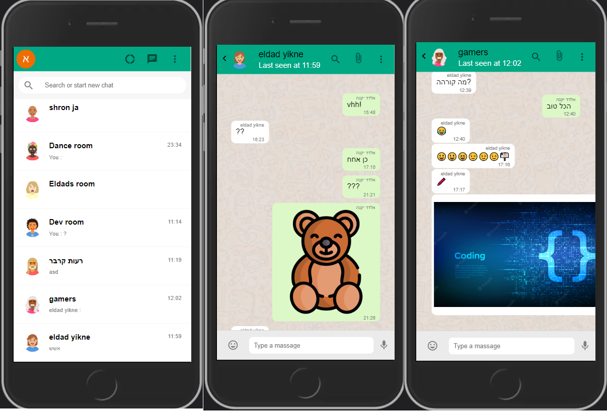

# Whatspop

An app I wrote with react, in which you can send message and images to your friends and a groups, add them from application user list.
[Here is my project link](https://eldadyikne.github.io/whatsapp/ "whatspop link")



## Whatspop Description
A small App that was built in a few days, I take that challenge to learn more of the use websocket like I want. 

### Technologies
- React.js
- React-Router
- PWA 
- Websocket
- Material UI
- Sass


## Getting started
Clone the project or dowload the files on top.

```sh
git clone https://github.com/eldadYikne/whatsapp.git
```

Open the terminal and enter the following line to run it locally on your computer:

```sh
npm start
```

Runs the app in the development mode. Open http://localhost:3000 to view it in the browser.


## Contacts list 
You can view your different contacts, filter them by name. In addition, you can send message to contact.

 
 
 ## Room CRUDL
You can CRUD your room any time.

 
 
 ## Some mobile!
Just a taste of the mobile experience. I used different mixins, conditional rendering, and the "mobile first" approach. 

